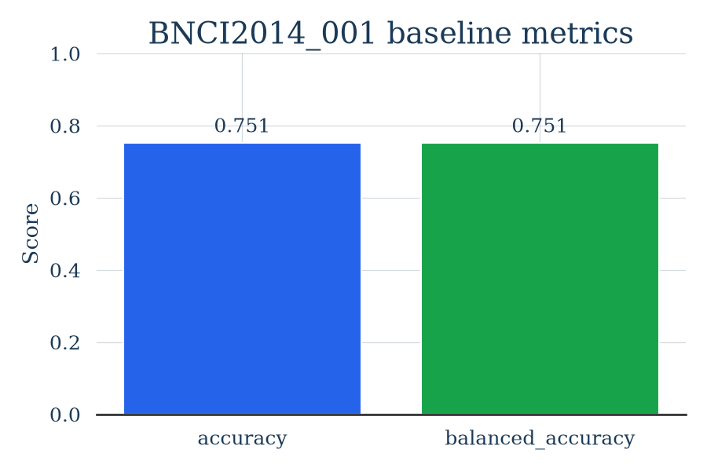
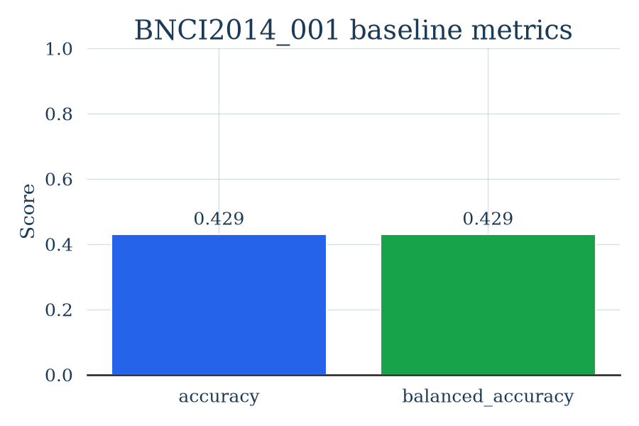
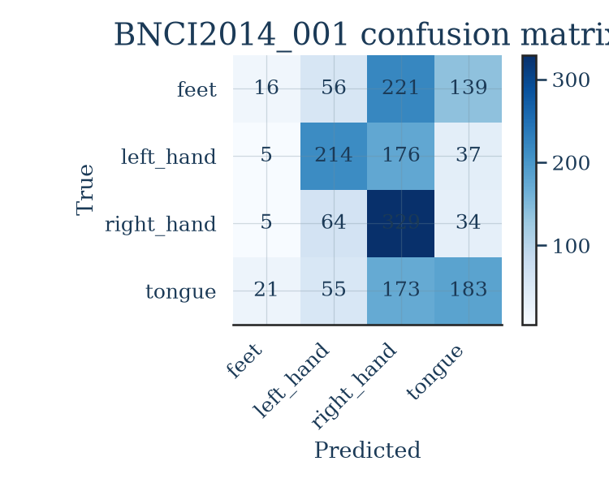

# BCI Dataset Cards

[](https://github.com/YG-paaleee/bci-dataset-cards/actions/workflows/ci.yml)


BCI Dataset Cards is a beginner-focused command-line tool for inspecting public EEG/BCI datasets, running one small reproducible baseline, and generating plain-language dataset cards.

The first supported target is `BNCI2014_001`, a common motor-imagery dataset exposed through [MOABB](https://moabb.neurotechx.com/). The goal is not to build a medical device. The goal is to make dataset assumptions, split strategy, baseline metrics, and limitations easier to inspect.

## What This Project Does

- Generates Markdown dataset cards for public BCI datasets, including license, DOI, and citation.
- Saves benchmark results as JSON.
- Runs a simple classical baseline for motor imagery: CSP + LDA.
- Reports the chance level and an (approximate) test of whether the score beats chance.
- Reports per-class precision/recall/F1 and a confusion matrix, not just overall accuracy.
- States leakage warnings and limitations explicitly.
- Avoids claims about diagnosis, treatment, emotion detection, or reliable assistive use.

## What This Project Does Not Do

- It does not read thoughts.
- It does not diagnose or treat medical conditions.
- It does not stream from EEG hardware.
- It does not replace clinical BCI systems.
- It does not prove a model will work on real users outside the tested dataset.

## Install

Use Python 3.11 or newer. A virtual environment is strongly recommended.

```powershell
cd C:\Users\ralph\Documents\bci-dataset-cards
py -m venv .venv
.\.venv\Scripts\Activate.ps1
py -m pip install --upgrade pip
py -m pip install -e .[bci,test]
```

If you only want to run the mocked unit tests without installing MOABB/MNE:

```powershell
py -m pip install -e .[test]
py -m pytest
```

## Usage

Generate a dataset card:

```powershell
bcicards scan --dataset BNCI2014_001
```

Run a tiny benchmark and update the card:

```powershell
bcicards benchmark --dataset BNCI2014_001 --subjects 1 2 3
```

Outputs:

```text
cards/BNCI2014_001.md
results/BNCI2014_001.json
results/BNCI2014_001.png
```

The first real MOABB run may download EEG data. That can take time.

## Dataset Downloads On Windows

MOABB/MNE may download public EEG files the first time you run a real benchmark. Keep those files outside the repo:

```powershell
$env:MNE_DATA = "$HOME\mne_data"
$env:MNE_DATASETS_BNCI_PATH = "$HOME\mne_data"
```

The `.gitignore` blocks common local data folders and `.mat` files so dataset downloads do not get committed by accident.

## Current Scope

Supported:

- Motor-imagery datasets: `BNCI2014_001`, `BNCI2014_004`, `Zhou2016`, `Weibo2014`
- CSP + LDA baseline
- Subject-aware splitting when multiple subjects are provided
- Stratified holdout when only one subject is provided
- Chance level + binomial significance check
- Per-class metrics and a confusion matrix
- License / DOI / citation surfaced in the card

Not supported yet:

- P300, SSVEP, c-VEP, or resting-state datasets
- Deep learning baselines
- Real-time hardware streams
- Web dashboards

## Example

[examples/BNCI2014_001.md](examples/BNCI2014_001.md) is **real output** from an
actual run on the public `BNCI2014_001` motor-imagery dataset (MOABB 1.5.0,
MNE 1.12.1, scikit-learn 1.9.0, seed 42):

```powershell
bcicards benchmark --dataset BNCI2014_001 --subjects 1 2 3
```

### Why this tool exists: within-subject vs cross-subject

The same CSP + LDA baseline gives very different numbers depending on how you split:

| Evaluation | Split method | Accuracy |
| --- | --- | --- |
| Subject 1 only | stratified holdout (within-subject) | **0.751** |
| Subjects 1, 2, 3 | leave-one-subject-out (cross-subject) | **0.429** |

Chance is 0.25 for these four classes, so both results contain real signal. But the
within-subject score is far more optimistic than the cross-subject score. Quoting the
0.751 number as if a model "works" is exactly the evaluation mistake this tool helps
beginners notice and avoid. The generated card always states the split method so the
number can't be read out of context.

| Within-subject (optimistic) | Cross-subject (honest) |
| --- | --- |
|  |  |

### Beyond accuracy

The card also reports the chance level and whether the score beats it (an approximate
binomial test), plus per-class precision/recall/F1 and a confusion matrix. On this run,
cross-subject accuracy is **0.429** vs a **0.25** chance level (binomial p < 0.001), but
the per-class breakdown shows the baseline barely detects the "feet" class - detail a
single accuracy number hides.



## Development

See [CONTRIBUTING.md](CONTRIBUTING.md) for setup and contribution guidance, and
[CHANGELOG.md](CHANGELOG.md) for release notes.

Run tests:

```powershell
py -m pytest
```

Run CLI smoke checks:

```powershell
bcicards --help
bcicards scan --help
bcicards benchmark --help
```

## Responsible Claims

This project is research tooling for public datasets. EEG signals are noisy, dataset-specific, and easy to overfit. Reported metrics are only meaningful with the stated split method, subject count, preprocessing, and dataset limitations.

Do not describe this project as medical software, mind reading, diagnosis, treatment, or a validated assistive communication system.

## Research Starting Points

- [MOABB documentation](https://moabb.neurotechx.com/docs/index.html)
- [MNE-Python](https://mne.tools/stable/index.html)
- [BrainFlow](https://brainflow.org/)
- [Non-Invasive BCI State of the Art and Trends](https://pmc.ncbi.nlm.nih.gov/articles/PMC11861396/)
- [UNESCO neurotechnology ethics standard](https://www.unesco.org/en/articles/ethics-neurotechnology-unesco-adopts-first-global-standard-cutting-edge-technology)
